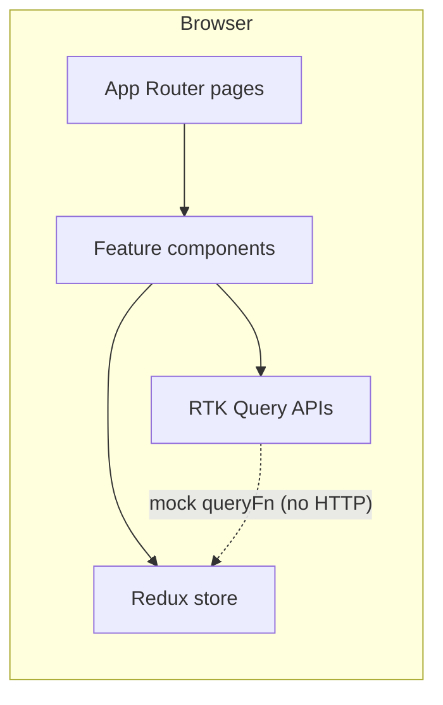

# AI Chat Assistant

A production-oriented web client for an AI-assisted chat experience with **role-based access**, **document upload and retrieval context**, and an **administrative console**. The application is implemented as a [Next.js](https://nextjs.org/) App Router project with [React](https://react.dev/) 19, [Redux Toolkit](https://redux-toolkit.js.org/) (including [RTK Query](https://redux-toolkit.js.org/rtk-query/overview)) for state and asynchronous data flows, and [Tailwind CSS](https://tailwindcss.com/) for styling.

---

## Table of contents

- [Capabilities](#capabilities)
- [Technology stack](#technology-stack)
- [Prerequisites](#prerequisites)
- [Getting started](#getting-started)
- [npm scripts](#npm-scripts)
- [Architecture](#architecture)
- [Application surface](#application-surface)
- [Data layer and API contracts](#data-layer-and-api-contracts)
- [Configuration and build behavior](#configuration-and-build-behavior)
- [Deployment](#deployment)
- [Repository provenance](#repository-provenance)

---

## Capabilities

| Area | Description |
|------|-------------|
| **Authentication** | Sign-in and registration flows with persisted session semantics (token and user profile in client state). |
| **Authorization** | Distinct **user** and **admin** roles; routing and landing behavior depend on role after authentication. |
| **Chat** | Session-based messaging with configurable **country context**, **AI-only vs hybrid** mode, optional **web search**, and optional **document-grounded** replies when uploads are attached. |
| **Documents** | Upload UI with mocked ingestion, summary, and embedding flags; vector search hook for future RAG backends. |
| **Administration** | Dashboard for aggregate statistics and a documents registry with lifecycle status and delete operations (mock-backed). |

---

## Technology stack

| Layer | Choices |
|-------|---------|
| **Framework** | Next.js 15 (App Router), TypeScript |
| **UI** | React 19, [Radix UI](https://www.radix-ui.com/) primitives, [shadcn/ui](https://ui.shadcn.com/)-style components, [Lucide](https://lucide.dev/) icons |
| **Styling** | Tailwind CSS 4, `tailwind-merge`, `class-variance-authority` |
| **State** | Redux Toolkit, RTK Query, `react-redux` |
| **Forms & validation** | `react-hook-form`, `@hookform/resolvers`, Zod |
| **Theming** | `next-themes` |
| **Charts & misc** | Recharts, Sonner (toasts), Embla carousel, Vaul (drawers), etc. (see `package.json`) |

---

## Prerequisites

- **Node.js**: LTS release recommended (compatible with Next.js 15 and the toolchain declared in `package.json`).
- **Package manager**: npm (default for this repository), or any client compatible with `package-lock.json` if present.

---

## Getting started

Clone the repository, install dependencies, and start the development server:

```bash
npm install
npm run dev
```

Open [http://localhost:3000](http://localhost:3000) in a browser. Unauthenticated visitors see the marketing shell; use **Sign In** or **Sign Up** to exercise authenticated routes.

### Demo admin role

Authentication is currently **simulated in the client**. For the mock login implementation, an email address containing the substring `admin` is treated as an **admin** account and is redirected to `/admin` after sign-in. All other successful logins receive the **user** role and are routed to `/dashboard`.

---

## npm scripts

| Script | Purpose |
|--------|---------|
| `npm run dev` | Start Next.js in development mode with hot reload. |
| `npm run build` | Produce an optimized production build. |
| `npm run start` | Serve the production build locally (run `build` first). |
| `npm run lint` | Run ESLint via `next lint`. |

---

## Architecture

High-level request and state flow:



- **App Router** (`app/`) owns layouts, metadata, and route segments (`/`, `/login`, `/register`, `/dashboard`, `/admin`).
- **Global providers** (`app/providers.tsx`) wrap the tree with the Redux `Provider` and theme support.
- **Feature UI** lives under `components/` (chat, dashboard chrome, admin, upload, shared `ui/` primitives).
- **State** is centralized in `store/` with slice reducers for auth, chat, UI, and documents, plus RTK Query API slices for side effects that mirror HTTP-style resources.

---

## Application surface

| Route | Audience | Purpose |
|-------|----------|---------|
| `/` | Public | Landing; redirects authenticated users by role. |
| `/login` | Public | Sign-in. |
| `/register` | Public | Account creation. |
| `/dashboard` | Authenticated user | Primary chat and document workflow. |
| `/admin` | Authenticated admin | Statistics and global document management. |

---

## Data layer and API contracts

RTK Query services are organized under `store/api/` with logical `baseUrl` segments (`/api/auth`, `/api/chat`, `/api/upload`, `/api/admin`). **There are no Next.js Route Handlers under `app/api/` in this repository**; endpoints use `queryFn` implementations that **simulate latency and responses** on the client. This keeps the UI fully functional for demos and allows a future swap to real `fetchBaseQuery` HTTP calls without changing consumer components, provided the server honors the same shapes.

When integrating a backend:

1. Replace `queryFn` mocks with `query` builders (or hybrid `queryFn` calling your origin).
2. Implement matching Route Handlers or an external API gateway.
3. Move secrets and tokens off the client except where appropriate (e.g., short-lived session cookies via Next.js middleware).

TypeScript interfaces in each API module (`AuthResponse`, `ChatRequest`, `UploadResponse`, `AdminDocument`, etc.) document the intended request and response contracts.

---

## Configuration and build behavior

`next.config.mjs` currently:

- Skips ESLint during production builds (`eslint.ignoreDuringBuilds: true`).
- Skips TypeScript emit errors during builds (`typescript.ignoreBuildErrors: true`).
- Uses **unoptimized** images (`images.unoptimized: true`), which is common for static export or constrained hosting; revisit when enabling Next.js Image Optimization.

Path aliases use `@/*` mapped to the repository root (`tsconfig.json`).

---

## Deployment

This project targets standard **Node** hosting for Next.js (for example [Vercel](https://vercel.com/) or any environment that runs `npm run build` followed by `npm run start`). Configure environment variables and server URLs according to your deployment target when you connect a real backend.

---

## Repository provenance

This codebase may stay in sync with designs or iterations created in [v0.app](https://v0.app) and deployed through connected hosting. Treat that integration as **optional workflow**; local development and version control remain the source of truth for engineers extending the application.
